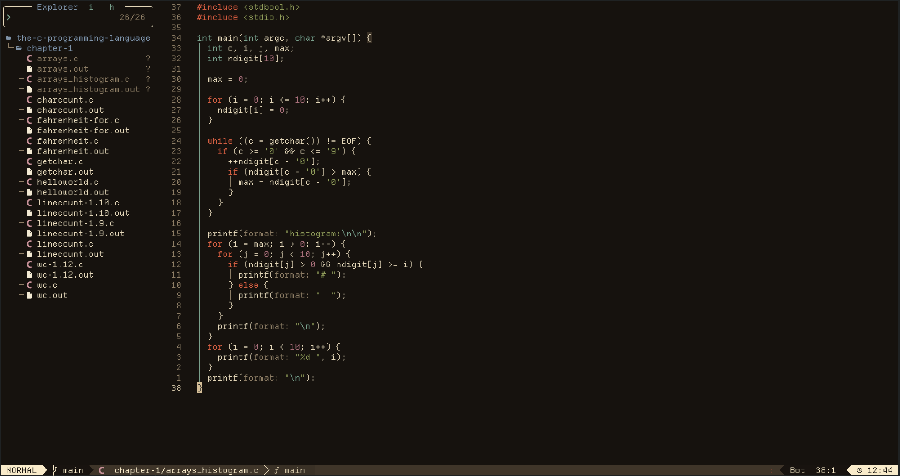
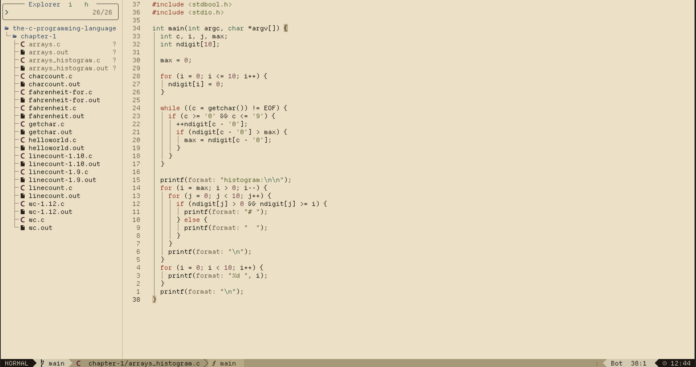
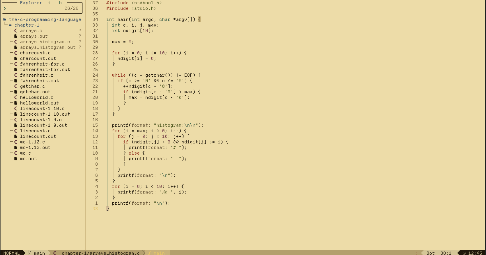
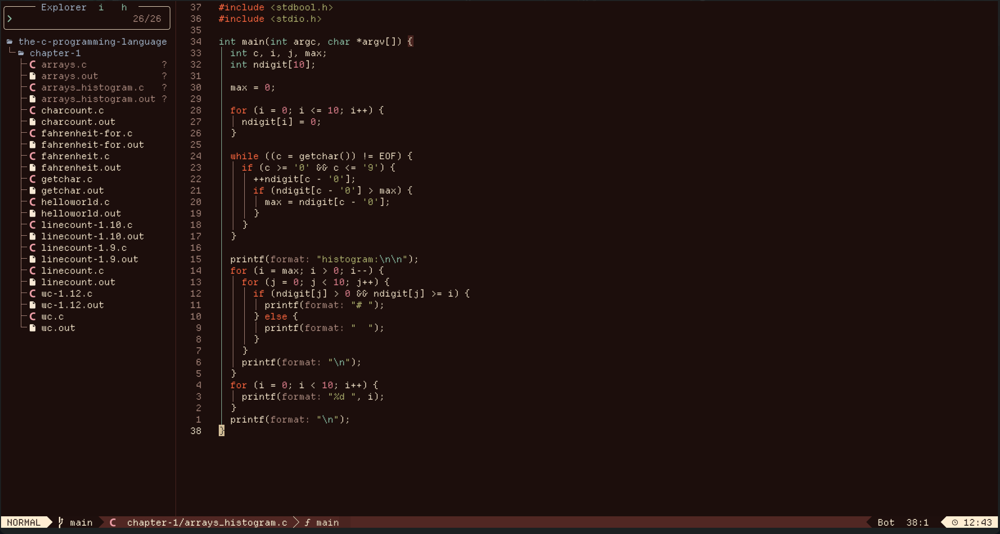

# Athanor Neovim Themes

A Neovim port of the original [Athanor](https://github.com/script-wizards/athanor) palette (Umber, Vellum, Orpiment, and Cinnabar).


## Installation

Using [lazy.nvim](https://github.com/folke/lazy.nvim):

```lua
return {
  {
    "gabichulas/athanor-nvim",
    lazy = false,
    priority = 1000,
    dependencies = {
      -- Required dependency for the palette engine
      "nvim-mini/mini.base16",
    },
    config = function()
      -- Load your preferred theme here (you can also choose with the :colorscheme command)
      -- Options: "umber", "vellum", "orpiment", "cinnabar"
      vim.cmd("colorscheme umber")
    end,
  }
}
```

## Preview

<table align="center">
  <tr>
    <td align="center"><b>Umber</b></td>
    <td align="center"><b>Vellum</b></td>
  </tr>
  <tr>
    <!-- Adjust the width value to fit your preferences -->
    <td></td>
    <td></td>
  </tr>
  <tr>
    <td align="center"><b>Orpiment</b></td>
    <td align="center"><b>Cinnabar</b></td>
  </tr>
  <tr>
    <td></td>
    <td></td>
  </tr>
</table>

## Credits

This work is based and inspired by the [Athanor](https://github.com/script-wizards/athanor) project by [Panat](https://x.com/ptaranat).

## License

MIT.
